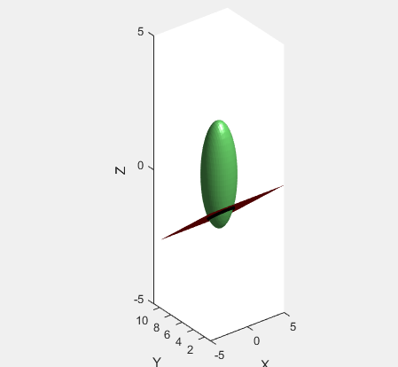
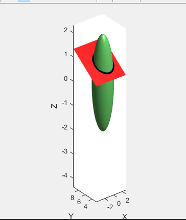
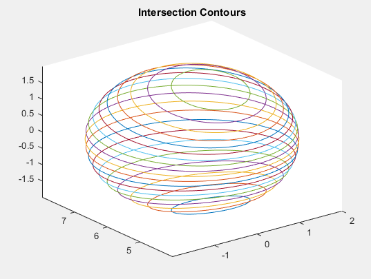
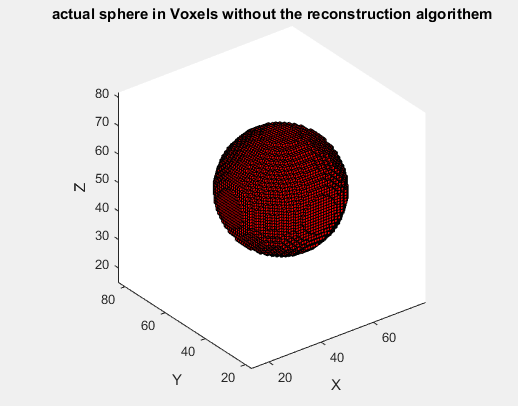
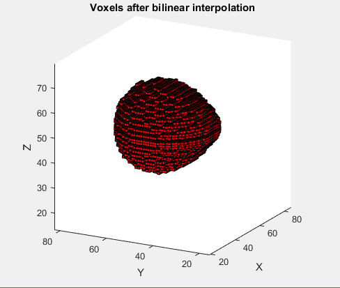

# Modeling-a-3D-ultrasound-scan-and-reconstruction
A sphere needs to be scanned in multiple angles and the resultant images need to be extracted. Then they would be used to reccreate the sphere. This was a task which was supposed to be completed in 24hrs.

Contours were observed to create the resultant image and classes (voxels) of the sphere were given values mapped to replicate the process of a scan to image as well as a image to scan. Bilinear interpolation was tried with in the allocated time to smooth the effects caused by lack of images to reconstruct the entire sphere.

The images below shows two scan angles and how it would interact with the sphere.

The image below shows the sample contours which would result from a scan. 

The image below shows the actual sphere as well as the sphere resulting from the recontruction and bilinear interpolation 

